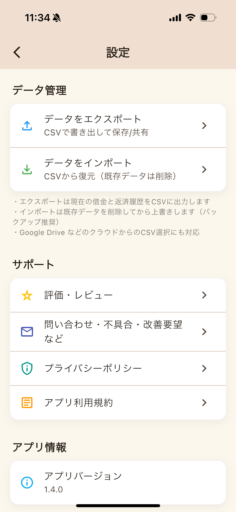

# Dream TODO (vision_todo)

「夢 → 目標 → TODO」を地図のように可視化し、週間の“仕分け（トリアージ）”でやることを整える、シンプルな個人向けタスク管理アプリです。Flutter + Riverpod + Isar で実装されています。

## 主な機能
- 夢/目標/TODOの階層管理: 夢（Dream）→ 長期目標（LongTerm）→ 短期目標（ShortTerm）→ TODO（Task）
- 週間トリアージ: 週の開始日に合わせて「今週やる／やらない」を素早く仕分け
- マップ表示（Maps）: 夢・目標・TODOをキャンバス上にレイアウトして俯瞰
- TODO一覧（フィルタ付き）: 夢・タグ・ステータス・優先度で絞り込み
- 詳細画面: TODO・目標・夢ごとの詳細、タグ表示、メモ保存
- 並び順の保存: 画面内の並び替え（Reorder）をローカルに保存
- 設定: 週の開始曜日（月曜/日曜）、完了表示切り替え、レビュー/問い合わせ導線

## 画面構成
- Home: 今週のTODOを目標単位で集約。右下の「+」から 夢/目標/TODO を追加
- TODO: 夢・タグでタブ切り替え、ステータス・優先度でさらに絞り込み
- Maps: 夢→目標→TODO をキャンバス上に可視化。ズーム/フィット操作、タグ管理
- Detail: TODO/目標/夢の詳細・編集（タイトル、期限、優先度、ステータス、タグなど）
- Triage: スワイプ/ボタンで「今週やる／やらない」を仕分け（自動起動・スキップ可）
- Settings: 週の開始曜日の変更、完了タスク表示の切り替え、アプリ情報 など

### スクリーンショット（例）
※ 画像は開発用の例です。

## データモデル（簡易）
- Dream: 夢。色/優先度/期限/達成フラグ
- LongTerm: 長期目標（Dreamに属する）
- ShortTerm: 短期目標（LongTermに属する、Tagと多対多）
- Task: TODO（ShortTerm または LongTerm に紐付け可）。優先度/期限/ステータス/週間計画
- Tag: タグ（ShortTerm/LongTerm と多対多）

内部ストレージ（アプリのドキュメントディレクトリ）に Isar データベースを作成します。並び順（orders.json）とメモ（memos.json）も同ディレクトリに保存されます。

## 技術スタック
- Flutter 3 系 + Dart 3.5
- 状態管理: hooks_riverpod
- ルーティング: go_router
- ローカルDB: isar / isar_flutter_libs（モバイル/デスクトップ対応）
- 補助: path_provider, package_info_plus, url_launcher, in_app_review

## セットアップ
1) 依存関係の取得

   flutter pub get

2) Isar のコード生成（モデル定義を変更した場合）

   dart run build_runner build --delete-conflicting-outputs

3) 実行

   flutter run

対応プラットフォーム: iOS / Android / macOS / Windows / Linux（Web は未対応）

## 使い方のヒント
- 追加: Home の右下「+」で 夢/目標/TODO を作成。作成時に優先度・期限も設定可能
- トリアージ: アプリ起動直後や週替わりに未仕分けがあれば自動で開きます。今週分は右スワイプ（または「今週やる」）／除外は左スワイプ（「やらない」）。その週は「スキップ」も可能
- 並び替え: 一覧のセクションはドラッグ＆ドロップで並び替え、次回以降も保存
- フィルタ: TODO ページで 夢/タグタブ、ステータス（未着手/進行中/完了）・優先度（低/中/高/最優先）を組み合わせて絞り込み
- メモ: 夢/目標/タスクごとにメモを保存（ローカル）
- 週の開始: Settings で「月曜/日曜」を切り替え（トリアージや集計に反映）

## ディレクトリ構成（抜粋）
- lib/
  - ui/ … 画面（home, todo, maps, dreams, triage, settings, widgets, theme 等）
  - models/ … Isar コレクション（dream, long_term, short_term, task, tag）
  - repositories/ … CRUD/集約（Task/Dream/Term/Tag）
  - providers/ … Riverpod プロバイダ
  - services/ … Isar 初期化、並び順/メモの保存処理
  - utils/ … 共通ユーティリティ（週の開始日計算など）

## よくある質問（FAQ）
- ビルドで生成コードエラーが出る
  - モデルを変更した場合は build_runner を再実行してください。
- データの保存場所は？
  - 端末ローカル（アプリのドキュメントディレクトリ）です。クラウド同期は未対応です。

## ライセンス
未指定（必要に応じて追記してください）。
